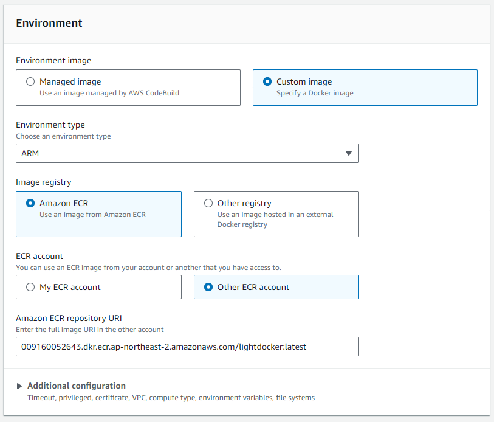

# codebuild-lightdocker
Use following image to get lightweight custom images for CodeBuild

```
009160052643.dkr.ecr.ap-northeast-2.amazonaws.com/lightdocker:latest
```

like this:


## this image contains
* alpine linux
* aws-cli v2
* docker cli & daemon

## this image supports
* arm64
* amd64
